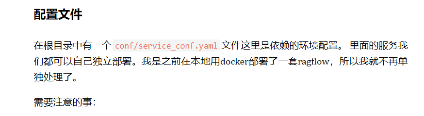

# Ragflow二次开发-tips


## 快速开始
1. 克隆项目仓库：
  ```bash
  git clone https://github.com/infiniflow/ragflow.git
  ```
2. docker启动：
  ```bash
  $ cd ragflow/docker
# Use CPU for embedding and DeepDoc tasks:
$ docker compose -f docker-compose.yml up -d

# To use GPU to accelerate embedding and DeepDoc tasks:
# docker compose -f docker-compose-gpu.yml up -d
  ```
3. 源码启动(uv版见官方文档 使用conda启动 )：
4.配置文件


如需更多信息，请访问 [Ragflow 官方文档](https://github.com/infiniflow/ragflow)。