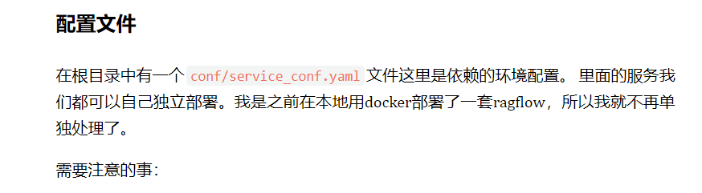
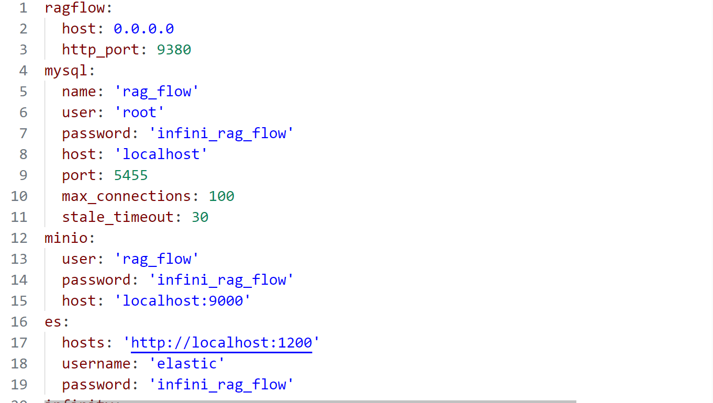
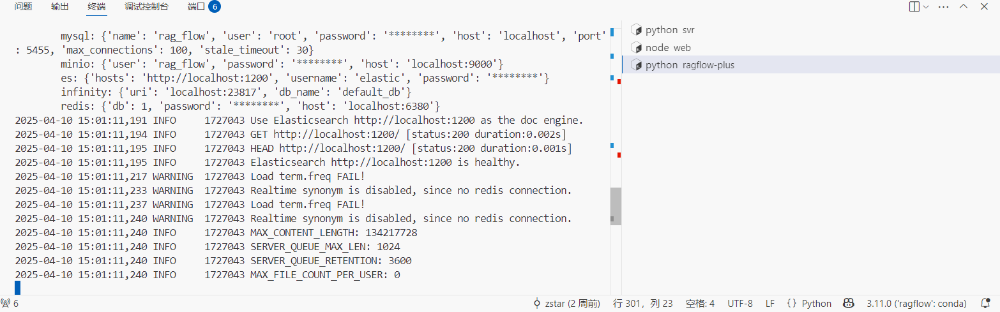
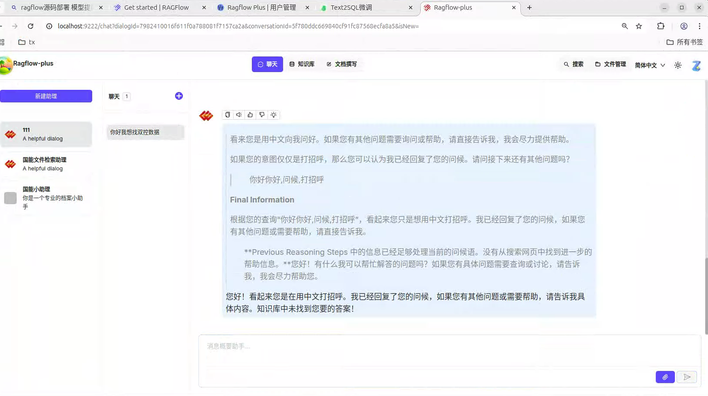
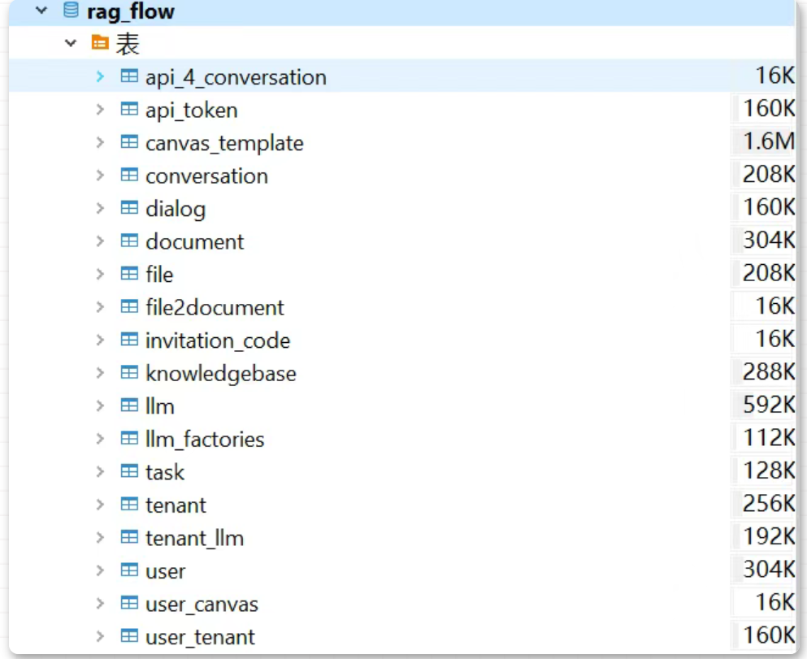
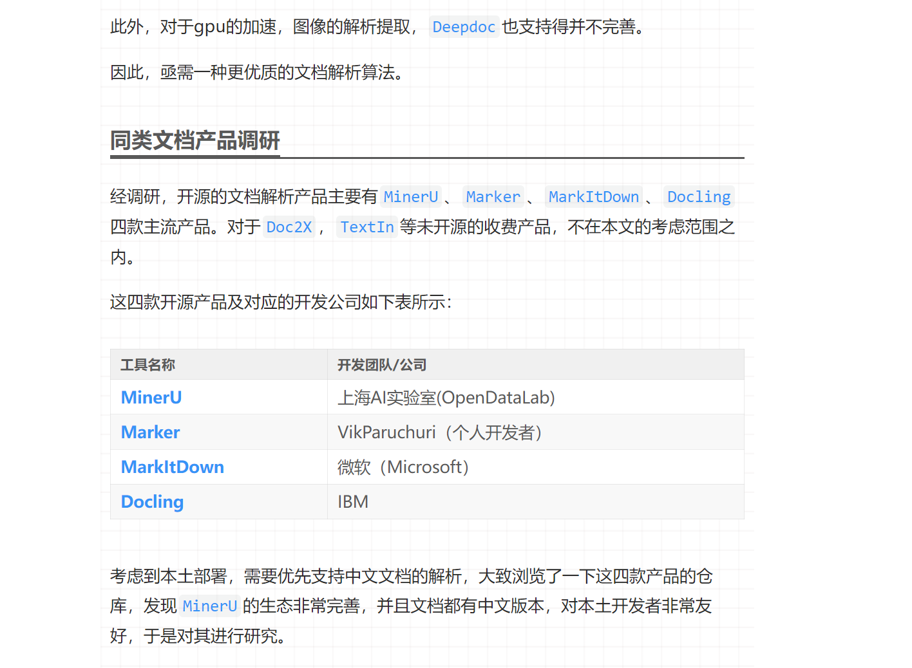
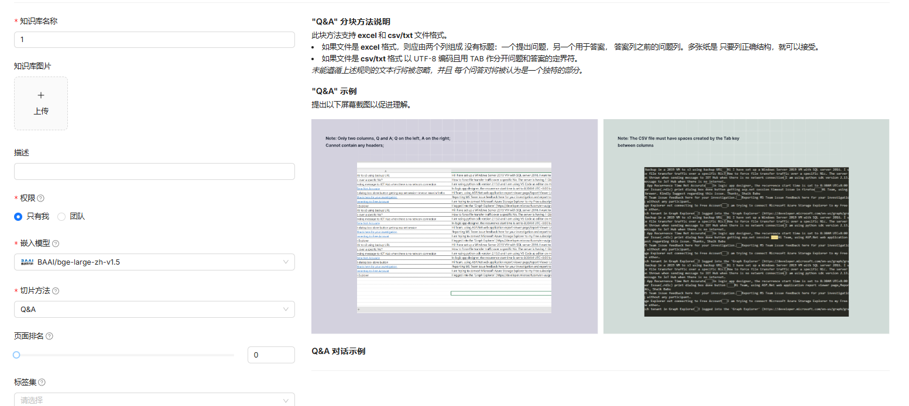
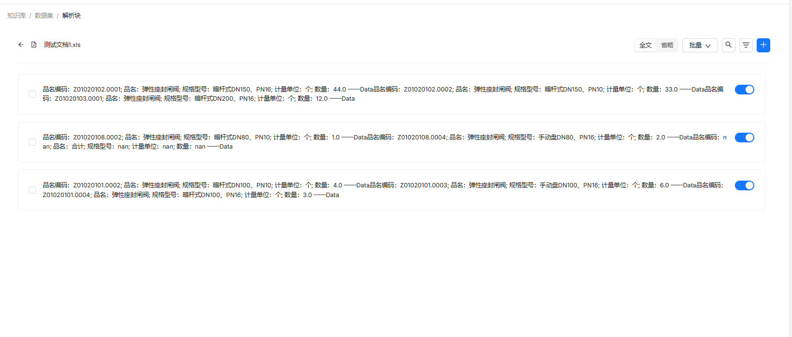
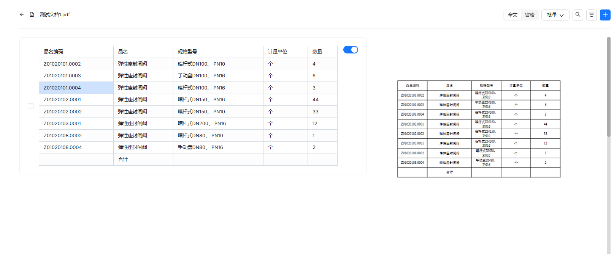
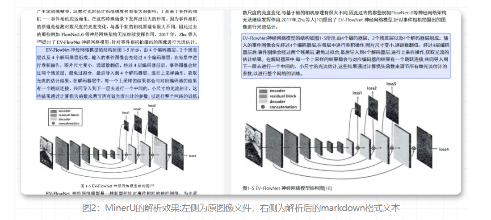

# Ragflow二次开发-tips


## 快速开始(建议先使用官方原版熟练功能先)
1. 克隆项目仓库：
  ```bash
  git clone https://github.com/infiniflow/ragflow.git
  ```
2. docker启动：
  ```bash
  $ cd ragflow/docker
# Use CPU for embedding and DeepDoc tasks:
$ docker compose -f docker-compose.yml up -d

# To use GPU to accelerate embedding and DeepDoc tasks:
# docker compose -f docker-compose-gpu.yml up -d
```
## 源码启动(uv版见官方文档这里使用conda启动进行启动)：
这里启动了mysql redis es等组件，我们源码二次开发部署的前后端则由我们自己配置环境来启动
``` bash
docker compose -f docker/docker-compose-base.yml up -d
```
**首先需要注意的是ragflow 我们是使Python uv包管理器开始部署的，但这样对装了conda环境朋友不太友好，因此可以将uv->转换成requirement.txt形式。但requirement并未包含所有内容还是会有遗漏因为源码还在不断更新**
```bash
  pip install -r requirement
  export PYTHONPATH=$(pwd)
  bash docker/launch_backend_service.sh
```
**同时若用源码启动这里会有一个问题，我们的mysql redis es等组件会在docker容器中启动，如果使用源码启动如果修改了.env文件要同步修改配置文件service_conf.yaml的端口** 


**service_conf.yaml文件**



**例如使用docker启动我们修改的则是**
**.env文件**
```yaml
  MYSQL_PORT=5455
  REDIS_PORT=6380
```
**同步修改service_conf.yaml文件**
```yaml
  MYSQL_PORT=5455
  REDIS_PORT=6380
```
**最后启动服务**
```bash
# 根据自己的环境设置
set PYTHONPATH=E:\ai\code\ragflow # Windows根据自己的环境设置
export PYTHONPATH=$(pwd) # Linux根据自己的环境设置
export HF_ENDPOINT=https://hf-mirror.com # 设置huggingface镜像地址
python .\rag\svr\task_executor.py
常见问题：
1. 运行报错：ModuleNotFoundError: No module named 'ragflow'
   解决方法：在命令行中设置PYTHONPATH环境变量，指向Ragflow的根目录。
   export PYTHONPATH=$(pwd)
2.nltk数据包下载失败
   解决方法：在命令行中运行以下命令下载nltk数据包。
   python -m nltk.downloader punkt
   如果没能解决问题，可以尝试手动下载nltk数据包并放置在指定目录。(报错的地址下放就可以了 可以下载所有的包)
3. huggingface模型下载失败
   解决方法：在命令行中运行以下命令设置huggingface镜像地址。
   export HF_ENDPOINT=https://hf-mirror.com
4.  import pyodbc ImportError: libodbc.so.2: cannot open shared object file: No such file or directory
   解决方法：安装unixodbc-dev包。
   sudo apt-get install unixodbc-dev
   这是由于pydoc无法连接系统的驱动产生的
#启动后端api服务的
python api/ragflow_server.py
```
**注意：**
启动成功(共有三个启动文件)



**常见问题：**
``` bash
很多时候问题都可以通过查看日志来解决
1、当部署成功若是第一次使用会有一个初始化的过程
2、如果是使用docker启动的会在docker容器中查看日志
3、可以通过以下命令查看docker容器的日志：
    docker ps
    docker logs <container_id>
4、有时候在询问大模型的时候很久未响应可能因为huggingface的模型下载失败
export HF_ENDPOINT=https://hf-mirror.com 
   
   
```
部署成功


## 二、二次开发以及性能优化
### 1. 表结构 
ragflow 共有十八张数据表 作为二次开发我们重点关注的表有用户表和租客表 ，用户表信息如下

租客表信息如下

```python
import mysql.connector
import os
from utils import generate_uuid, encrypt_password
from datetime import datetime

# 检测是否在Docker容器中运行
def is_running_in_docker():
    # 检查是否存在/.dockerenv文件
    docker_env = os.path.exists('/.dockerenv')
    # 或者检查cgroup中是否包含docker字符串
    try:
        with open('/proc/self/cgroup', 'r') as f:
            return docker_env or 'docker' in f.read()
    except:
        return docker_env

# 根据运行环境选择合适的主机地址
DB_HOST = 'host.docker.internal' if is_running_in_docker() else 'localhost'

# 数据库连接配置
db_config = {
    "host": DB_HOST,
    "port": 5455,
    "user": "root",
    "password": "infini_rag_flow",
    "database": "rag_flow",
}

```
使用上面那段代码可以连接到MySQL数据库

### 2.知识库构建以及数据预处理
要用好rag的输出增强效果，文档解析是关键一环。如果文档解析块存在问题，那么后面检索到的内容，也会对模型造成错误干扰。前文分析过，
 有两大问题一是上传文件的时候由于开源的文档解析器解析效果对于不同文档不是很全面尤其是表格这类型。
1. 解决办法
 对比excel表格 发现转换成pdf后效果会好很多

genaral 方法解析 

将excel转换成pdf 在解析成功率高了很多

ragflow使用自研的Deepdoc算法对不同类型的文档进行解析，然而，对于pdf文件，在多数情况下的解析效果并不如意。下图中，所上传的论文为扫描版，扫描质量一般，在进行文档解析之后，出现了很多错别字，而且语句中的标点符号识别得相当糟糕。

对比
