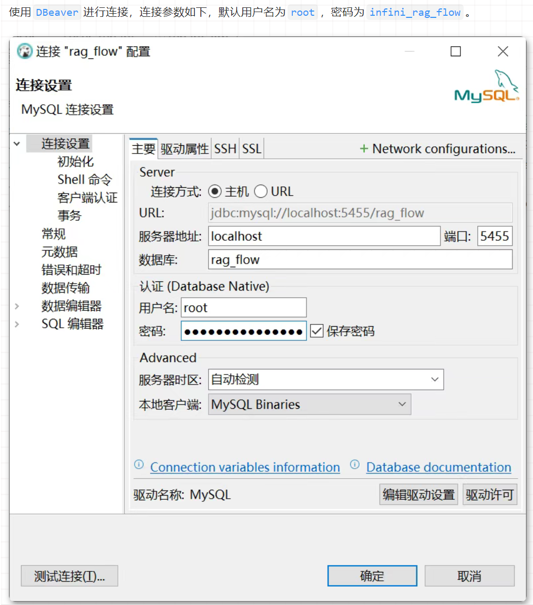

这是一个包含了 Docker 启动服务、前后端框架分析、容器组件功能、可视化分析等内容的技术文档。


## 3.1 容器组件分析

通过 Docker 启动该服务时，`docker-compose-base.yml` 包含了部分基础配置参数。可以看到，整个服务共包含 5 个容器组件：

```yaml
services:
  es01:
    container_name: ragflow-es-01
  infinity:
    container_name: ragflow-infinity
  mysql:
    container_name: ragflow-mysql
  minio:
    container_name: ragflow-minio
  redis:
    container_name: ragflow-redis
```
各组件功能如下：

Elasticsearch：主要用作文档引擎，负责存储和检索文本及向量数据，作为系统的知识库存储后端，用以支持向量存储和相似度搜索。

ragflow-infinity：前端系统，包含基本的界面显示、数据交互、路由跳转等功能。

MySQL：关系型数据库，存储系统的结构化数据，包括管理用户账户、权限等基础信息、存储知识库的元数据信息等。

MinIO：对象存储服务，用于存储原始文档及文档切片图像信息。

Redis：内存数据库，采用 Valkey 版本，缓存大模型的响应结果，处理异步任务，临时保存对话上下文。

## 3.2 前后端框架分析
该系统的前端框架使用 React + TypeScript，代码统一存放在 web 文件夹中。后端框架使用 Flask + Python，代码分为多个部分，具体内容如下：

agent：对应前端 agent 相关模块功能。

agentic_reasoning：对应前端搜索相关模块功能。

api：核心后端程序，用来与前端进行数据对接，并提供后端服务和其它各组件连接及数据交互功能。

deepdoc：提供文件 OCR 等解析相关功能。

graphrag：知识图谱相关功能。

rag：主要用以和大模型相关接口进行交互。

sdk：拓展型功能，用来提供系统的外部调用，目前尚不完善，可以忽略。

## 3.3 前后端可视化分析
### 3.3.1 前端可视化分析
前端代码全部集成在 web 文件夹下，因此可以直接在该路径下启动并查看。首先安装依赖：
安装完成后，生成 node_modules 再启动：
```bash
cd web
yarn/pnpm install
```
```bash
yarn start
```
**访问 http://localhost:9222 即可进入登录界面。考虑到登录需要与后端交互，密码验证通过后，才能进入主界面。如果需要直接进入主界面预览，可以修改 web/src/utils/request.ts 文件，修改逻辑如下**：
    
```typescript
request.interceptors.response.use(async (response: Response, options) => {
  if (response?.status === 413 || response?.status === 504) {
    return new Response(JSON.stringify({
      code: 0,
      message: 'Success',
      data: {}
    }));
  }
});
```
### 3.3.2 MySQL 可视化分析
    可以使用 DBeaver 连接 MySQL 数据库，连接参数如下，默认用户名为 root，密码为 infini_rag_flow。连接后，可以看到数据库中包含多张数据表，后续在解决实际问题时会进一步分析。

### 3.3.3 Elasticsearch 可视化分析
Elasticsearch 需要通过 Kibana 进行可视化分析。虽然 .env 文件中写了 Kibana 的初始用户名和密码，但实际服务中并未启用 Kibana。可以参考仓库中提出的问题：PR 548。

### 3.3.4 MinIO 可视化分析
MinIO 自带可视化管理的控制台，访问 http://localhost:9001/ 即可进入，默认用户名为 rag_flow，默认密码为 infini_rag_flow。进入后可以看到，里面的容器包含了原始上传的 PDF 文件和切块分页的图像数据。

### 3.3.5 Redis 可视化分析
可以使用 Redis Insight 连接 Redis 数据库，默认地址为 127.0.0.1:6379，默认用户名为 default，默认密码为 infini_rag_flow。进入后可以看到，里面存储了一些缓存数据。


## 4. 问题解决方法以及用户模型
4.1 关闭注册通道
要关闭注册通道，可以直接将前端界面上的注册元素注释掉。具体方法是修改 src/pages/login/index.tsx 文件，注释掉以下内容：

``` tsx
{ 
  title === 'login' && (
    <div>
      {t('signInTip')}
      <Button type="link" onClick={changeTitle}>
        {t('signUp')}
      </Button>
    </div>
  )
}
{ 
  title === 'register' && (
    <div>
      {t('signUpTip')}
      <Button type="link" onClick={changeTitle}>
        {t('login')}
      </Button>
    </div>
  )
}
```
这样修改后，用户即使访问 /register 页面，也无法注册，因为注册功能并不是单独的界面，而是在登录界面中通过后端进行处理。

### 4.2 后台添加用户
关闭注册通道后，管理员还需要为用户进行注册。可以通过直接修改数据库内容的方式进行。用户信息存储在 user 表中，表中包含字段 email 和 password。密码是哈希存储的，为了防止泄露，需要使用加密逻辑。

### 4.3 设置用户模型
用户模型配置涉及到 tenant 和 tenant_llm 两张数据表。tenant 表记录了每个用户的模型配置。具体的插入操作将与用户团队表格一块进行更新。

### 4.4 设置用户团队
用户团队信息存储在 user_tenant 表中。设置用户团队时，需要插入两条记录：一条是用户自己的团队，方便后续组建小团体；另一条是将新用户的团队记录插入到老用户的团队下。

### 4.5 批量插入用户数据脚本
批量插入用户数据的 Python 脚本如下：

``` python
import mysql.connector
import uuid
import base64
import json
from datetime import datetime
from Cryptodome.PublicKey import RSA
from Cryptodome.Cipher import PKCS1_v1_5
from werkzeug.security import generate_password_hash

# 数据库连接配置
db_config = {
    "host": "localhost",
    "port": 5455,
    "user": "root",
    "password": "infini_rag_flow",
    "database": "rag_flow",
}

# 生成随机的 UUID 作为 id
def generate_uuid():
    return str(uuid.uuid4()).replace("-", "")

# 密码加密
def encrypt_password(raw_password: str) -> str:
    base64_password = base64.b64encode(raw_password.encode()).decode()
    encrypted_password = rsa_psw(base64_password)
    return generate_password_hash(base64_password)

# 处理批量注册
def batch_register_students():
    # 从 JSON 文件加载学生数据
    with open("add.json", "r", encoding="utf-8") as json_file:
        student_groups = json.load(json_file)

    try:
        conn = mysql.connector.connect(**db_config)
        cursor = conn.cursor()

        for group in student_groups:
            tenant_id = group["tenant_id"]
            student_ids = group["student_id"]

            for student_id in student_ids:
                user_id = generate_uuid()
                create_time = 1741361741738
                create_date = datetime.strptime("2025-03-07 23:35:41", "%Y-%m-%d %H:%M:%S")
                update_time = 1741416354403
                update_date = datetime.strptime("2025-03-08 14:45:54", "%Y-%m-%d %H:%M:%S")

                student_email = student_id + "@xidian.cn"
                raw_password = student_id
                hash_encrypted = encrypt_password(raw_password)

                # 插入 user 表数据
                user_insert_query = """
                INSERT INTO user (
                    id, create_time, create_date, update_time, update_date, access_token,
                    nickname, password, email, avatar, language, color_schema, timezone,
                    last_login_time, is_authenticated, is_active, is_anonymous, login_channel,
                    status, is_superuser
                ) VALUES (%s, %s, %s, %s, %s, %s, %s, %s, %s, %s, %s, %s, %s, %s, %s, %s, %s, %
```